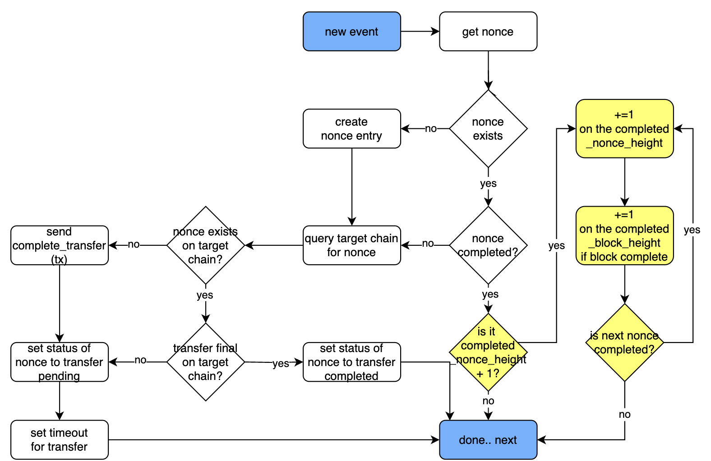
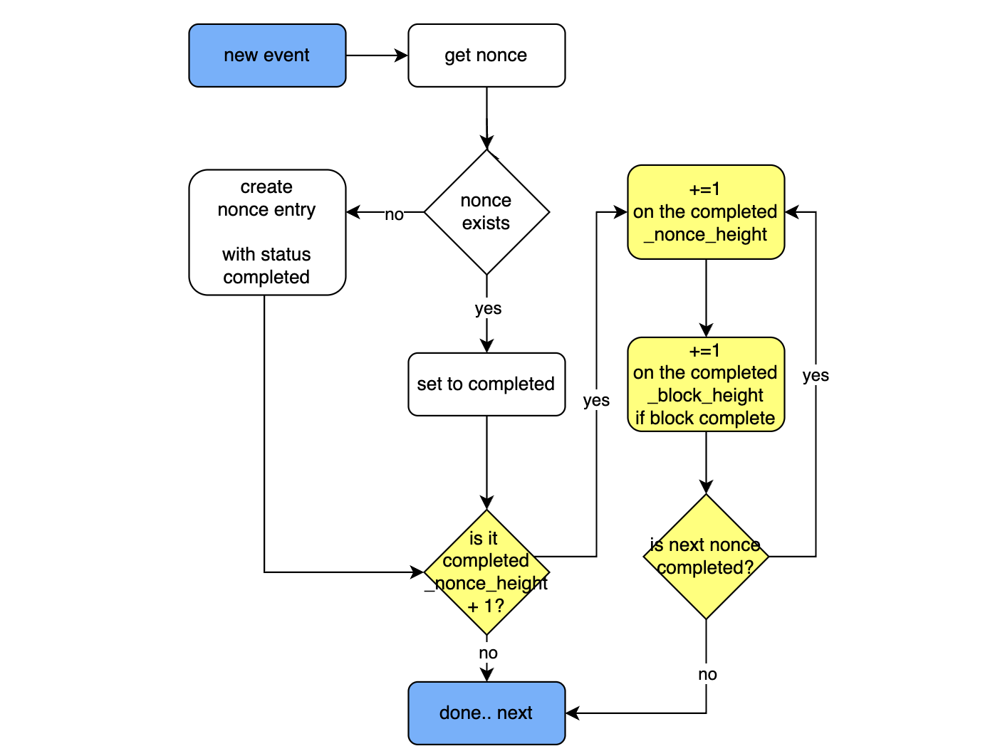

# MIP-61: Relayer for the lock/mint Native Bridge - Algorithm and Bootstrapping

- **Description**: This MIP describes the process for continuous operation as well as the bootstrapping of the relayer in the lock/mint bridge.
- **Authors**: Andreas Penzkofer, Philippe

## Abstract

We describe an algorithm that

- Continuously checks for `initiate_transfer` events on the source chain.
- Issues a `complete_transfer` transaction on the target chain if not done so far.
- Checks the completion of transfers on the target chain.
- Records the source chain block height, below which all transfers are completed on the target chain.
- Provides a bootstrap algorithm for the relayer.

In this algorithm the target chain contract offers a `complete_transfer` function that records transfer by `nonce` and protects against re-issuance as any nonce can be only mapped to one transfer.

## Motivation

We would like to minimize the number of trusted components. In a minimal solution the relayer should only trust the source chain, the target chain and itself. Other trusted sources can be proposed optionally, but ideally no other trust assumptions should be utilized.

Several complications:

- The `complete_transfer` transaction to the target chain for bridge transfers may fail, get lost, or other. Hence we cannot rely on delivery.
- The relayer may loose local memory.
- The relayer may have to be replaced.
- The relayer (or its replacement) MUST not ignore a single transfer.
- The relayer (or its replacement) MUST deliver eventually all transfers.
- The finality criteria on the source chain and target chain MUST be considered.

**Bootstrapping**
Currently, when the relayer starts, it doesn't reload the state that it has when it shuts down. If transfers are processed when the relayer stops, the transfers are lost and the relayer is not able to continue the transfer.

Moreover, even if the data would be stored on where to continue, the relayer may crash for a variety of reasons. The relayer can go offline or crash. It needs to automatically understand which `complete_transfer` transactions it still needs to send to the target chain.

## Context

This algo is defined using the lock/mint-type Native Bridge protocol, described in [MIP-58](https://github.com/movementlabsxyz/MIP/pull/58).This bridge protocol has two function calls :

- `initiate_transfer` on the source chain (called by user)
- `complete_transfer` on the target chain (called by relayer)

This algorithm is compatible with using finalized blocks (see the remark on L2 complete verification). By pulling only finalized source blocks, the nonce are always updated on finalization.

In this MIP we consider the lock/mint Native Bridge, see [MIP-60](https://github.com/movementlabsxyz/MIP/pull/60). We will discuss a single direction of transfer - from **source chain** to **target chain**.

## Specification

> _The key words "MUST", "MUST NOT", "REQUIRED", "SHALL", "SHALL NOT", "SHOULD", "SHOULD NOT", "RECOMMENDED", "NOT RECOMMENDED", "MAY", and "OPTIONAL" in this document are to be interpreted as described in RFC 2119 and RFC 8174._

!!! . The algorithm is the same in both directions. Hence each algorithm has to be implemented twice. Once for the transfer direction L1 --> L2, and once for the L2 --> L1 direction.

The relayer can get its state from the source chain and target chain. The relayer operates two processes - potentially in parallel:

**1. CONTINUOUS_BLOCK_PROCESSING**: The relayer pulls transfer events from new finalized blocks from the source chain and processes them. Since we consider finalized blocks and this is a blockchain, new blocks are processed in order. For each transfer the relayer has to check if the transfer is completed on the target chain, and if not it has to complete the transfer.

**2. BOOTSTRAPPING:** The relayer initiate the event polling at some point in the past. This point is either the genesis, some configurable source block height, or some checkpoint (possibly set on-chain)

### Assumptions on the Bridge Protocol

**Nonce**:
We assume the Native Bridge protocol MUST implement the assignment of an incrementing `nonce` on the source chain. Since there are two directions there MUST be two types of counters (`nonces`) - one for each transfer direction. The `nonce` is used to order the transfers.

**Initiate Transfer**:
The `initiate_transfer` function on the source chain is called by the user. It emits an event `initiate_transfer` with the following properties:

```javascript
{
    nonce: Number,          // Unique incrementing value for ordering transfers
    recipient: String,  // Address of the recipient on the target chain
    initiator: String,   // Address of the initiator on the source chain
    amount: Number          // Amount being transferred
}
```

This structure is used to record the transfer on the source chain.

**Complete Transfer**:
The `complete_transfer` function on the target chain is called by the relayer. It emits an event `complete_transfer` with the following properties:

```javascript
{
    nonce: Number,         // Matching nonce from the source chain
    transferUID: String,   // Unique identifier for the transfer
    recipient: String,     // Address of the recipient
    initiator: String,      // Address of the initiator
    amount: Number         // Amount that was transferred
}
```

This structure is used to record the transfer on the target chain.

### Relayer Structures


Locally the relayer stores the following structure:

```javascript
// Relayer Local Structure
{
    nonces: {                          // Object keyed by nonce (integer)
        [nonce: Number]: {             // Nonce as the integer key
            blockHeight: Number,       // Height of the block containing the nonce
            status: String,            // Status of the event
            eventUID: String           // Unique identifier for the event
        }
    }
}
```

The relayer differentiates three status types:

- `transfer_initiated`: the event has been received but not processed and the `complete_transfer` transaction has not been sent to the target chain.
- `transfer_pending`: the `complete_transfer` transaction has been sent to the target chain but is not yet finalized.
- `transfer_completed`: we received the (finalized) complete event.

**Optimization**: There's another substate for pending when the `complete_transfer` transaction failed. In this case we should retry earlier than if the `complete_transfer` transaction was successful. We MAY differentiate the state `transfer_pending_executed` and `transfer_pending_failed`.

### initiate_transfer events

#### 1. INIT_EVENT_PROCESSING algorithm

For each `initiate_transfer` event do the following:


```javascript
INIT_EVENT_PROCESSING:
// Input: initiate_transfer event from source chain
// Input: target_chain_state - current state of the target chain
SET `nonce` = `initiate_transfer_event.nonce` 
    with nonce.status_transfer = `transfer_initiated`
SET `transfer_uid` = `initiate_transfer_event.transfer_uid`

// Check if the `nonce` is already recorded
IF `nonce` is recorded THEN:
    IF `nonce.status_transfer` is `transfer_completed` THEN:
        RETURN.
ELSE: 
    CREATE new `nonce` entry locally and save it in ORDERED_SET.

// note this is not the final state as is the case for most other state reads in this algorithm
QUERY target chain contract for `nonce` in non-final and final state
        
// If `complete_transfer` transaction was sent previously to target chain
IF `nonce` is found on target chain THEN:
    IF `transfer_uid` does not match THEN:
        REPORT error and EXIT

    IF `nonce` transfer is final THEN:
        SET `nonce.status_transfer` to `transfer_completed`
        CLEAR cached data for `nonce` to free up memory
    ELSE:
        // the status should be `transfer_pending`
        IF `nonce.status_transfer` is NOT `transfer_pending` THEN:
            LOG "error: nonce.status_transfer is not transfer_pending"
        SET `nonce.status_transfer` to `transfer_pending`
        SET timeout for relayer to re-check later
// If no `complete_transfer` transaction was sent 
ELSE:
    SEND `complete_transfer` transaction to target chain
    SET `nonce.status_transfer` to `transfer_pending`
    SET timeout for relayer to re-check later
```


> [!NOTE]
> The relayer may send a transaction `complete_transfer` to the target chain for an entry that has the status `transfer_pending`. This status exists during the time between the sending and the finalized success of the `complete_transfer` transaction on the target chain.

#### 2. CONTINUOUS_BLOCK_PROCESSING algorithm

Next we describe the processing of source blocks and the completion of a transfer on the target chain, assuming the relayer is always online. Since this is a strong assumption, we reduce this requirement in the next section.


```javascript
CONTINUOUS_BLOCK_PROCESSING: 
// Input: source_block - newly finalized block from source chain
NEW `block` with blockHeight `source_block.height` in `blocks`

// Process each initiate_transfer event
FOR EACH `event` IN `source_block.initiate_transfer_events` DO:
    RUN INIT_EVENT_PROCESSING(`event`)

// Mark the block as processed, this 
SET `block.status` as `block_processed`
```

> [!NOTE]
> Setting the source_block.status as processed and storing that information in a file, or similar, could help with bootstrapping the relayer in the future.

#### 3. PROCESS_FINISHED_NONCE_HEIGHT algorithm

In this section the process is defined to calculate the completed part of the source chain `completed_block_height` and `completed_nonce_height`.



Replace

```javascript
IF `nonce.status_transfer` is `transfer_completed` THEN:
    RETURN
```

with

```javascript
PROCESS_FINISHED_NONCE_HEIGHT:
IF `nonce.status_transfer` is `transfer_completed` THEN:
    IF `nonce` is not `completed_nonce_height + 1` THEN: 
        RETURN
    ELSE:
        SET `completed_nonce_height += 1`
        // the following pruning is required to keep the memory sane.
        DELETE every `nonce` with `nonce` < `completed_nonce_height`
        IF this `nonce` is the last nonce in the source block THEN:
            SET `completed_block_height += 1`
        IF the next `nonce.status_transfer` is `transfer_completed` THEN:
            GOTO PROCESS_FINISHED_NONCE_HEIGHT
        ELSE:
            RETURN
```

#### 4. TIMEOUT algorithm

Whenever the timeout of a transfer (which has `transfer_pending` status) is triggered. Start the event processing.

```javascript
TIMEOUT:
// Input: timeoutTriggeredEvent - Event whose timeout has been triggered

ON timeoutTriggered(`timeoutTriggeredEvent`) DO:
    // Check if the transfer has a pending status
    IF `timeoutTriggeredEvent.status` is `transfer_pending` THEN:
        // Start the event processing for the triggered event
        RUN EVENT_PROCESSING(`timeoutTriggeredEvent`).
    ELSE:
        // If status is not pending, ignore or log
        LOG "Timeout triggered for a non-pending transfer.";
```


### complete_transfer events

#### 1. COMPLETE_EVENT_PROCESSING algorithm

Similar to the INIT_EVENT_PROCESSING algorithm, the COMPLETE_EVENT_PROCESSING algorithm processes the finalized `complete_transfer` events on the target chain.

We can apply a similar algorithm as for the INIT_EVENT_PROCESSING algorithm.

```javascript
COMPLETE_EVENT_PROCESSING:
// Input: complete_transfer event from target chain
SET `nonce` = `complete_transfer_event.nonce` 
    with nonce.status_transfer = `transfer_completed`
SET `transfer_uid` = `complete_transfer_event.transfer_uid`

// Check if the `nonce` is already recorded
IF `nonce` is recorded THEN:
    SET `nonce.status_transfer = transfer_completed` 
ELSE: 
    CREATE new `nonce` entry locally and save it in ORDERED_SET.

RETURN.
```

As can be seen, the algorithm is simpler than the INIT_EVENT_PROCESSING algorithm. 

#### 2. PROCESS_FINISHED_NONCE_HEIGHT algorithm

Similar to Section [PROCESS_FINISHED_NONCE_HEIGHT](#PROCESS_FINISHED_NONCE_HEIGHT_algorithm), we also utilize the `complete_transfer` events to calculate the `completed_block_height` and `completed_nonce_height` for the target chain.

For this we replace the `RETURN` above with `PROCESS_FINISHED_NONCE_HEIGHT`.



### BOOTSTRAP algorithm

Next we describe how the bootstrap algorithm works and differs from the above.

> [!NOTE]
> A node that is bootstrapping SHOULD start the CONTINUOUS_BLOCK_PROCESSING algorithm in parallel. This allows to immediately assume normal operation while attempting to catch up with what has been missed.


The Algorithm differs from the CONTINUOUS_BLOCK_PROCESSING in that it runs in parallel and will catch up with missing transfers eventually. While not hindering the continuous operation of the Relayer.

```javascript
BOOTSTRAPPING
// Start the continuous block pocessing protocol in parrallel to this algorithm
START CONTINUOUS_BLOCK_PROCESSING protocol 
SET `first_CP_block` = first processed block by CONTINUOUS_BLOCK_PROCESSING

// Set initial processed block parameters
SET `end_source_block` = `first_CP_block` - 1
SET `start_source_block` = some INPUT value

// Process source blocks in the specified range
FOR `current_block` = `start_source_block` TO `end_source_block` DO:
    RUN CONTINUOUS_BLOCK_PROCESSING using `current_block` as the source block.
```

#### Bootstrap input types

**Manual input**
Based on knowledge of when the relayer stopped, we can inject a parameter about the source block height from which the relayer should start to bootstrap. Default is the genesis or some arbitrary long interval in the past, e.g. 2 weeks.

**Reading from local memory**
In the CONTINUOUS_BLOCK_PROCESSING Algorithm the Relayer can record the height of the source block `completed_block_height` as described in the Calculation-Completed-Block-Height algorithm. When rebooting or bootstrapping the node, the relayer can start from the last point it left.

**Reading from chain**
The relayer records on the source or target chain (whichever is cheaper) the `completed_block_height` (see [PROCESS_FINISHED_NONCE_HEIGHT](#calculation-of-completed-source-block-height). This can happen infrequent. A separate algorithm needs to be spelled out which records the highest source block, below which all source blocks with transfers are completed.

## Considered Alternatives

1. Use of indexer DB.

This creates a dependency to another component. For example, if the postgres db has an issue, the relayer has an issue. Even thought the relayer doesn't need the db to process.

## Reference Implementation

## Verification

## Changelog

## Appendix

## Copyright

Copyright and related rights waived via [CC0](../LICENSE.md).
